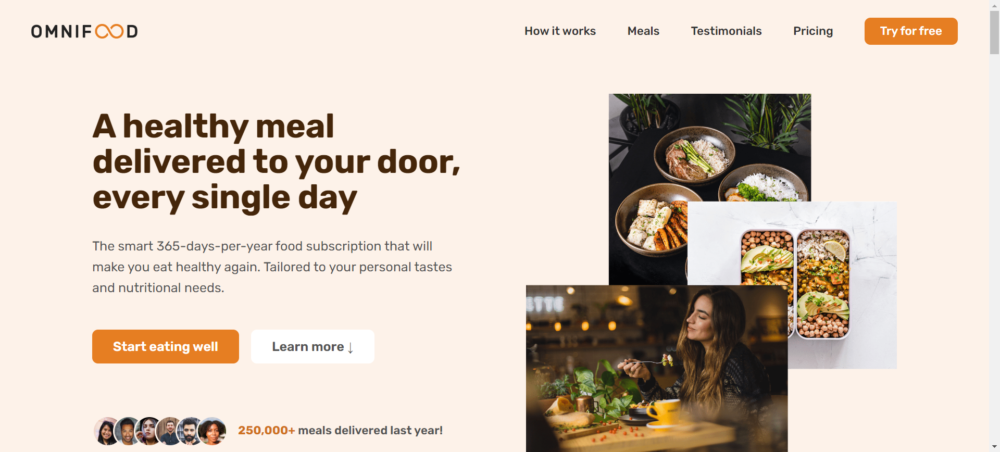

<div id="top"></div>


<!-- PROJECT LOGO -->
<br />
<div align="center">
  <a href="https://omnifood-ahmedalam98.netlify.app/">
    
    <h1 align="center">Omnifood</h1>
  </a>
  <p align="center">
    <a href="https://omnifood-ahmedalam98.netlify.app/">View Demo</a>
    ·
    <a href="https://github.com/ahmedalam98/Omnifood/issues">Report Bug</a>
  </p>
</div>

<!-- TABLE OF CONTENTS -->
<details>
  <summary>Table of Contents</summary>
  <ol>
    <li>
      <a href="#about-the-project">About The Project</a>
      <ul>
        <li><a href="#built-with">Built With</a></li>
      </ul>
    </li>
    <li>
      <a href="#getting-started">Getting Started</a>
      <ul>
        <li><a href="#installation">Installation</a></li>
      </ul>
    </li>
    <li><a href="#contributing">Contributing</a></li>
    <li><a href="#acknowledgments">Acknowledgments</a></li>
  </ol>
</details>

<!-- ABOUT THE PROJECT -->

## About The Project




A website for a technology company with a major focus on consumer well-being through a healthy diet by using an AI-centric approach.

Users can use this website to select their diet and foods they like and dislike and the AI algorithm will create a custom and individual weekly meal plan.

All this will be packed up in a monthly subscription, where users can choose between receiving one or two meals per day, every single day of the month.

<p align="right">(<a href="#top">back to top</a>)</p>

### Built With

- HTML
- CSS
- JavaScript
- Netlify

<p align="right">(<a href="#top">back to top</a>)</p>

<!-- GETTING STARTED -->

## Getting Started

This project doesn't require any prequesites or dependenscies and you can view it online using this [demo](https://omnifood-ahmedalam98.netlify.app/)

To get a local copy up and running follow these simple steps :

### Installation

1. Clone the repo
   ```sh
   git clone https://github.com/ahmedalam98/Omnifood.git
   ```
2. open `index.html` file

<p align="right">(<a href="#top">back to top</a>)</p>

<!-- CONTRIBUTING -->

## Contributing

Contributions are always welcome!

If you have a suggestion that would make this better, please fork the repo and create a pull request. You can also simply open an issue with the tag "enhancement".
Don't forget to give the project a star! Thanks !

1. Fork the Project
2. Create your Feature Branch (`git checkout -b feature/AmazingFeature`)
3. Commit your Changes (`git commit -m 'Add some AmazingFeature'`)
4. Push to the Branch (`git push origin feature/AmazingFeature`)
5. Open a Pull Request

<p align="right">(<a href="#top">back to top</a>)</p>

<!-- ACKNOWLEDGMENTS -->

## Acknowledgments

- [Jonas schmedtmann](https://github.com/jonasschmedtmann)
